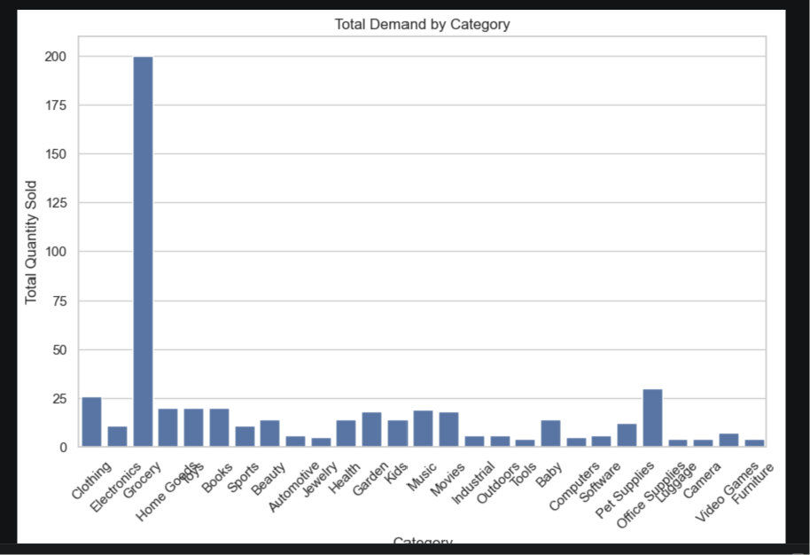
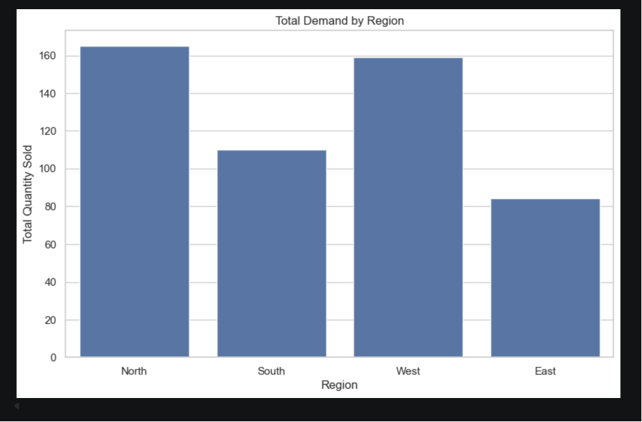
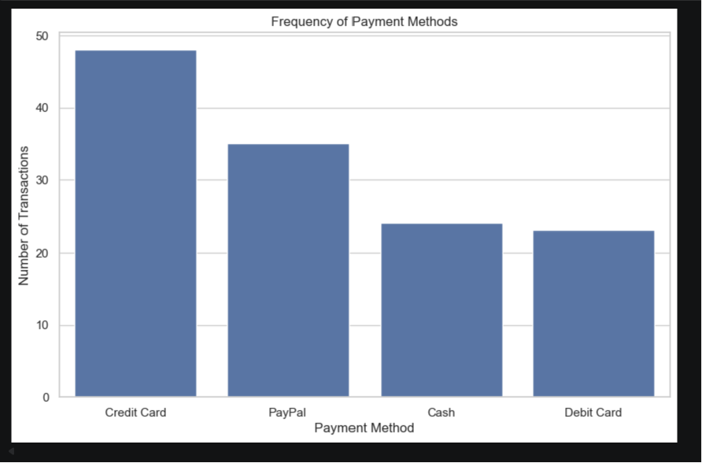
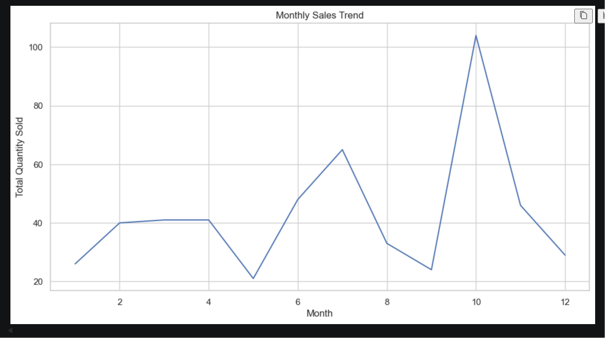
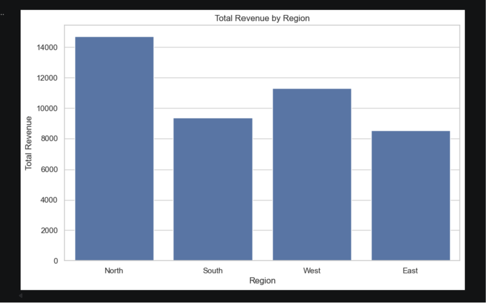

# 📊 Inventory Demand Analysis using Customer Behaviour Data

## 📌 Problem Statement
Local businesses often rely on assumptions rather than real data to plan inventory. This can lead to overstocking or stock shortages.  
This project aims to analyze customer purchase behaviour and use data-driven insights to improve inventory planning by following a structured data science lifecycle.

---

## 🔬 Data Science Lifecycle

### 1. Problem Definition
Define the problem and project objectives. The primary goal is to analyze customer purchase data to identify demand patterns and provide actionable insights for inventory management.

### 2. Data Collection
The dataset used for this analysis is `sales_extended.csv`, which contains transactional data from a local business.

### 3. Data Cleaning
- Handle missing values
- Correct data types
- Remove duplicate records
- Ensure data consistency

### 4. Feature Engineering
- Extract temporal features like month, day, and year from `Purchase_Date`
- Create new features like `Revenue` (Quantity * Price)

### 5. Exploratory Data Analysis (EDA)
- Analyze demand by product category, region, and payment method
- Identify top-selling products
- Analyze monthly and seasonal sales trends
- Explore customer purchase behavior

### 6. Approach Selection
This project will focus on an analytical approach to derive insights from historical data. For a more advanced implementation, machine learning models could be used for demand forecasting.

### 7. Visualization
- Create visualizations to represent demand patterns, sales trends, and revenue analysis.
- Use bar charts, line charts, and other plots to communicate findings effectively.

### 8. Insights & Recommendations
- Summarize key findings from the analysis.
- Provide data-driven recommendations for inventory management, such as optimizing stock levels and planning for seasonal demand.

---

## 🛠️ Tech Stack
- Python
- Pandas
- Matplotlib
- Seaborn
- Jupyter Notebook (VS Code)

---

## 📊 Dataset Description
The extended dataset (`sales_extended.csv`) contains:
- `Customer_ID` → Unique customer identifier  
- `Product_ID` → Product identifier  
- `Category` → Product category (e.g., Electronics, Clothing, Grocery)  
- `Quantity` → Number of items purchased  
- `Price` → Price of product  
- `Purchase_Date` → Date of purchase
- `Region` → Geographic region of the sale (e.g., North, South, East, West)
- `Payment_Method` → Payment method used (e.g., Credit Card, PayPal, Cash)

---

## 📈 Potential Key Insights
- Grocery category has the highest demand across all regions.
- Electronics sales are higher in the North and South regions.
- Seasonal demand peaks for certain categories (e.g., Clothing in winter).
- Credit Card is the most frequently used payment method.

---

## 📦 Business Recommendations
- Increase stock for high-demand categories like Grocery, especially in regions with higher sales.
- Optimize inventory for Electronics based on regional performance.
- Plan marketing campaigns and stock for seasonal products.
- Analyze payment method trends to streamline payment processing.

---

## 💡 How This Helps Inventory Planning
- Identifies high-demand products, categories, and regions.
- Reduces overstocking and stock shortages.
- Supports data-driven decision-making.
- Improves efficiency and reduces business losses.

---

## 🚀 Conclusion
Following a structured data science approach provides valuable insights that can guide better inventory decisions. Using data instead of assumptions helps businesses optimize stock, improve performance, and drive growth.

