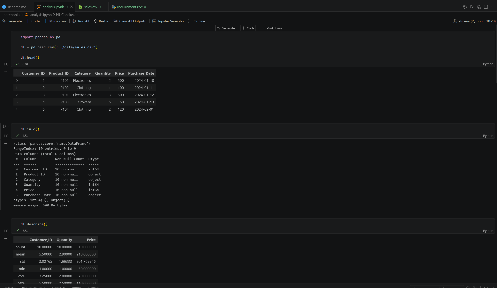
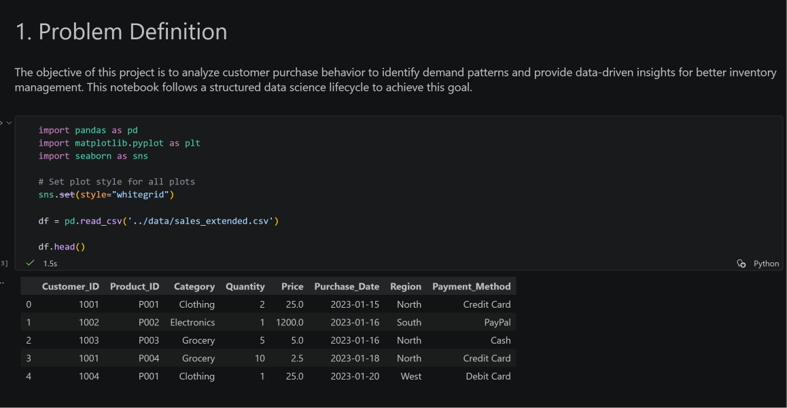
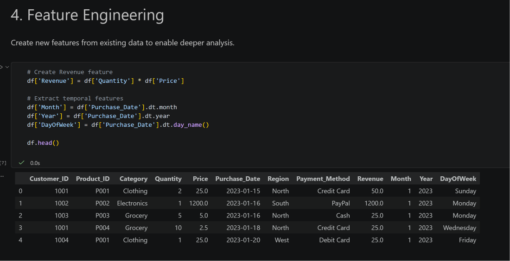
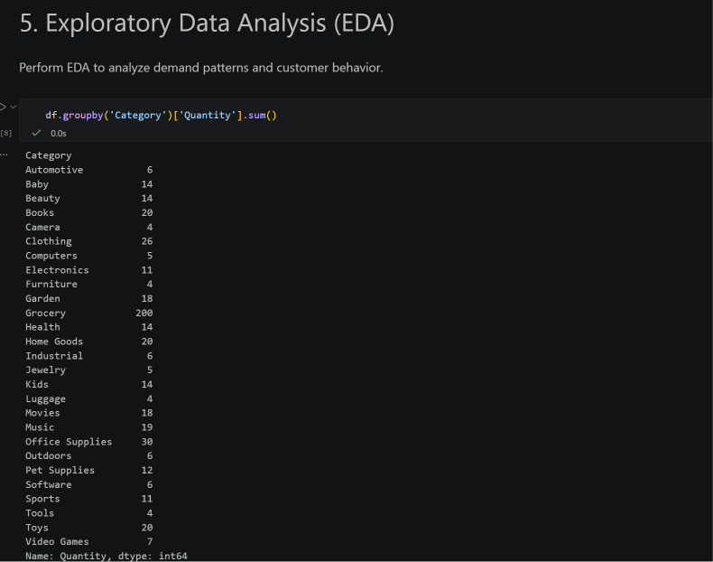

# 📊 Inventory Demand Analysis using Customer Behaviour Data

## 📌 Problem Statement
Local businesses often rely on assumptions rather than real data to plan inventory. This can lead to overstocking or stock shortages.  
This project aims to analyze customer purchase behaviour and use data-driven insights to improve inventory planning.

---

## 🎯 Objective
- Analyze customer purchase data
- Identify demand patterns across categories and products
- Provide insights for better inventory management

---

## 🛠️ Tech Stack
- Python
- Pandas
- Matplotlib
- Jupyter Notebook (VS Code)

---

## 
---

## 📊 Dataset Description
The dataset contains:
- Customer_ID → Unique customer identifier  
- Product_ID → Product identifier  
- Category → Product category (Electronics, Clothing, Grocery)  
- Quantity → Number of items purchased  
- Price → Price of product  
- Purchase_Date → Date of purchase  

---

## 🔍 Exploratory Data Analysis (EDA)
- Data cleaning and preprocessing  
- Category-wise demand analysis  
- Product-wise demand analysis  
- Monthly trend analysis  
- Revenue calculation  
- Data visualization using bar and line charts  

---

## 📈 Key Insights
- Grocery category has the highest demand  
- Electronics has moderate demand  
- Clothing has lower demand  
- Certain products are purchased more frequently  
- Demand varies across months (seasonal trends)  

---

## 📦 Business Recommendations
- Increase stock for high-demand categories like Grocery  
- Maintain balanced inventory for Electronics  
- Avoid overstocking low-demand categories like Clothing  
- Focus on high-selling products to maximize revenue  
- Use monthly trends for better inventory planning  

---

## 💡 How This Helps Inventory Planning
- Identifies high-demand products and categories  
- Reduces overstocking and stock shortages  
- Supports data-driven decision making  
- Improves efficiency and reduces business losses  

---

## 🚀 Conclusion
Customer behaviour data provides valuable insights that can guide better inventory decisions.  
Using data instead of assumptions helps businesses optimize stock and improve performance.

---
 

=======
S65-0326-Compile-AppliedDataScience
data science project
group project

